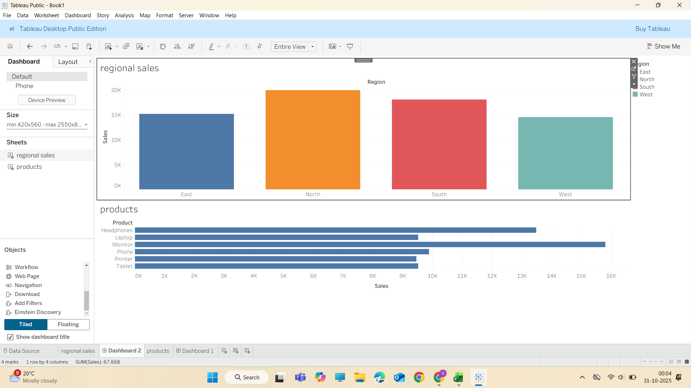

 📊 Sales Performance Analysis Dashboard

This project analyzes sales performance using **Excel** and **Tableau** to identify key business insights and visualize them interactively.

 📁 Project Overview

* **Goal:** Understand sales trends, identify top-performing regions and products, and visualize them through a dashboard.
* **Tools Used:** Excel, Tableau

 🧠 Insights

1. **Regional Sales:** Displays total sales across regions to identify high-performing areas.
2. **Top Products:** Highlights the best-selling products by total revenue.

🎨 Tableau Dashboard

This dashboard provides a clear overview of:

* Sales distribution by region
* Top-performing products

🧾 Files in this Repository

* `Excel_Analysis.xlsx` → Source dataset used for visualization
* `Tableau_Dashboard.png` → Screenshot of the final dashboard

🌟 Key Takeaway

A concise yet powerful visualization that turns raw sales data into actionable insights for better decision-making.
